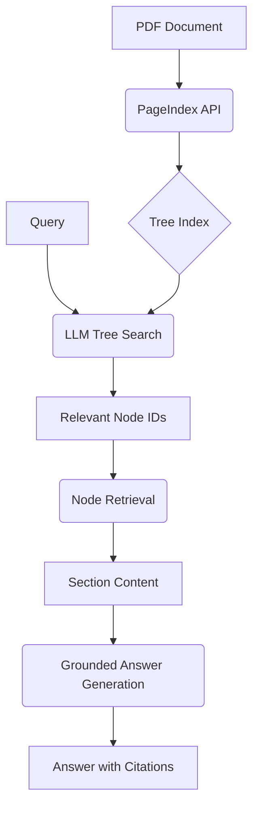

# 📑 Vectorless RAG — Reasoning-based Retrieval

Vectorless RAG is a professional-grade implementation of a "Reasoning-based RAG" pipeline. Unlike traditional RAG, which relies on chunking and vector embeddings, this system uses the document's inherent hierarchical structure and LLM reasoning to achieve higher precision and relevance.

## 🔑 Why Vectorless?

1.  **Context Preservation**: No arbitrary chunking. Sections (chapters, sub-sections) remain intact.
2.  **Structural Intelligence**: The LLM understands the "Table of Contents" of the document, allowing it to navigate to exact answers.
3.  **Expert Guidance**: Zero-shot domain adaptation using "Expert Routing Rules" instead of fine-tuning embeddings.
4.  **Traceability**: Every answer is grounded in specific sections and page numbers.

## 🚀 Architecture



## 🛠️ Setup

1.  **Clone the project** to your local environment.
2.  **Install dependencies**:
    ```bash
    pip install -r requirements.txt
    ```
3.  **Configure API Keys**: Create a `.env` file with:
    ```env
    PAGEINDEX_API_KEY=your_pageindex_key
    GROQ_API_KEY=your_groq_key
    ```

## 📱 Usage

Run the Streamlit app:
```bash
streamlit run app.py
```

## 📁 Repository Structure

- `rag_engine.py`: Core logic for the Vectorless RAG pipeline.
- `app.py`: Interactive Streamlit chatbot interface.
- `requirements.txt`: Project dependencies.
- `README.md`: This documentation.
- `PageIndex.ipynb`: Original research and development notebook.
